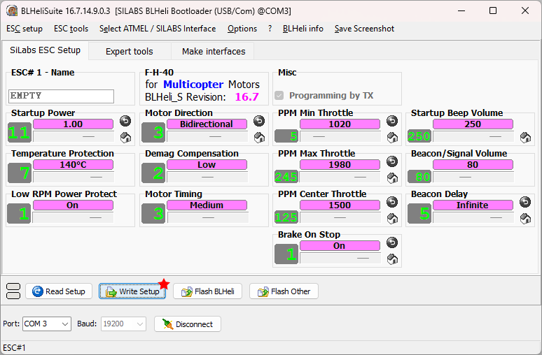

This is my fork of the Greenjay firmware. [Greenjay (link to parent repo)](https://github.com/bird-sanctuary/greenjay/) firmware is a derivative of [BLHeli_S](https://github.com/bitdump/BLHeli) and [Bluejay](https://github.com/bird-sanctuary/bluejay/) firmware. It runs on small ESCs to drive electric motors.

Brushless motor ESCs (electronic speed controllers) that are running BLHELI_S firmware can be converted to run brushed motors. This is great because these ESCs are small, are cheap, they can handle a lot of current, and they can be easily replaced if they break.

NOTE: when a brushless ESC is being used in brushed mode, the current rating is reduced by about 66%

NOTE: disadvantages are: no BEC, no current limiting

Since this is a bit of an unsupported hack, there's a ton of steps involved, and you will need some tools.

Downloads Needed
===

 * Firmware HEX files ([see the hex directory](hex))
 * [BLHeliSuite](https://github.com/4712/BLHeliSuite/releases/tag/16714903)

Tools Needed
===

 * RC radio system (a radio transmitter and a receiver), or a servo tester of some sort
 * USB linker for ESCs
   * example product: [USB Linker Compatible with BL32 BLS AM32 Brushless ESC Open Source Speed Control Programming](https://www.amazon.com/Linker-Compatible-Brushless-Control-Programming/dp/B0CCXGFSB3/ref=sr_1_2)
   * example product: [BL32 USB Linker Brushless ESC Open Source Speed Control Programming](https://www.amazon.com/FLASH-HOBBY-Brushless-Control-Programming/dp/B0B6V274JB/ref=sr_1_1)
   * example product: [ESC PC Software Adapter USB Linker Programmer Update for BLHeli Firmware](https://www.amazon.com/ZHIPAIJI-Software-Programmer-Firmware-Multicopter/dp/B09TPFLGBJ/ref=sr_1_3)
   * If you don't have any of these, then run BLHeliSuite, and it has a `Make Interface` tab that shows you how to use an Arduino to act as a USB linker
   * For more instructions, see [Oscar Liang's guide](https://oscarliang.com/connect-flash-blheli-s-esc/)
 * Some way of powering up the ESC
   * this could be just whatever battery that you wanted to use to power your project
 * A brushed motor to test with (or a multimeter)

Step 0
===

Install all the software mentioned, and install the USB driver for whatever USB linker you have.

For your convenience:

 * [FTDI drivers https://ftdichip.com/drivers/](https://ftdichip.com/drivers/)
 * [SiLabs drivers https://www.silabs.com/developers/usb-to-uart-bridge-vcp-drivers](https://www.silabs.com/developers/usb-to-uart-bridge-vcp-drivers?tab=downloads)
 * [CH340 drivers https://learn.sparkfun.com/tutorials/how-to-install-ch340-drivers/all](https://learn.sparkfun.com/tutorials/how-to-install-ch340-drivers/all)

Step 1 - Reading Original Settings
===

Plug in the USB linker to your computer via the USB cable. Do **not** power on your ESC, but plug the ESC into the USB linker.

Run BLHeliSuite.

Select the correct interface type, which should be `SiLabs BLHeli Bootloader (USB/Com)`.

Select the correct COM port number that's associated with your USB linker, and click connect.

Then the software will wait for you to power on your ESC.

At this point, power on your ESC. The wait dialog will disappear. Click on the "Read Setup" button.

The screen will populate with data and a confirmation dialog will appear. The most important thing right now is to remember the identification code of this particular ESC.

IMPORTANT: You must remember this identification! It is also useful for when you need to restore brushless mode.

Step 2 - Find Correct HEX File
===

In the `hex` directory, you will see a bunch of files:

Here's the name being explained:

Find the files that matches your ESC's identification. Do not worry about the phase pin combination for now. **Download all three**. Use the "download raw file" option to make sure it gets saved as a `*.HEX` file.

Step 3 - Flash
===

Inside BLHeliSuite, click on "Flash Other".

Select the file you want to flash, in this case, pick the one that matches your ESC's identification and use `_1_` for the phase-pin-combination.

When you confirm your file selection, you will see a final warning dialog, click `YES` to continue.

The flashing process will begin and you will see the progress, and then a confirmation will appear when it is done.

It may ask you to write settings, select `no`. We will need to change the settings before writing them.

Step 4 - Change Settings
===

Edit all the setting items to match the following screenshot, and then click `Write Setup`.

Step 5 - Test
===

Now it is time to test it. Unplug the ESC from the USB linker, and plug the ESC into your RC receiver. Turn on your RC radio system.

Through trial and error, figure out which two out of the three solder-tabs are the correct solder-tabs to control a brushed motor. Wire up a brushed motor with two wires and experimentally connect them to solder-tabs.

NOTE: you can do this test with a multimeter, getting both a strong positive and a strong negative voltage means you have found the correct combination

Step 6 - Change the Pins
===

If you want to change which two out of the three solder-tabs are being used as the output, then change the file you flash. The phase-pin-combination number of the file name determines which solder-tabs are being used as output. But exactly which one is what combination is a mystery that can only be discovered by experimenting.

Other Notes
===

While this is a fork, the only change I've made:

 * make sure all 3 combinations are automatically built
 * appended `GJ_` to the file names
 * placed all files in the `src` directory

I am unlikely to ever update the source code, and it is unlikely that BLHeli_S or the upstream Greenjay repository get updated.
